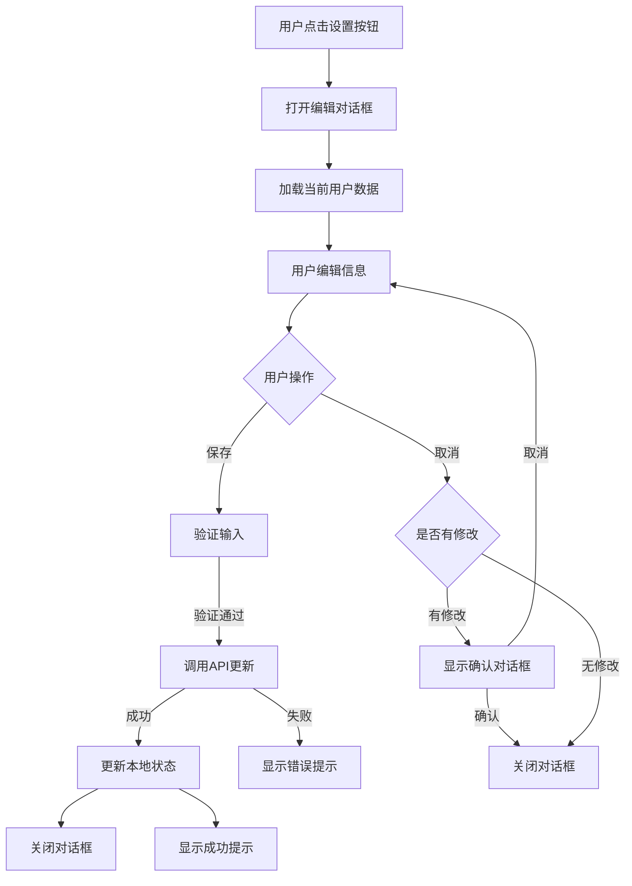

# 设计文档

## 概述

本设计文档描述了个人中心编辑功能的技术实现方案。该功能允许用户编辑个人资料，包括头像、昵称和个性签名。设计采用 shadcn/ui 组件库，确保与现有应用的视觉风格保持一致，并提供良好的用户体验。

## 架构

### 组件层次结构

```
ProfilePage (现有)
└── ProfileEditDialog (新增)
    ├── Dialog (shadcn/ui)
    │   ├── DialogTrigger (设置按钮)
    │   └── DialogContent
    │       ├── DialogHeader
    │       │   └── DialogTitle
    │       ├── AvatarUpload (新增)
    │       │   └── Avatar (shadcn/ui)
    │       ├── Form Fields
    │       │   ├── Label (shadcn/ui)
    │       │   ├── Input (shadcn/ui)
    │       │   └── Textarea (shadcn/ui)
    │       └── DialogFooter
    │           ├── Button (取消)
    │           └── Button (保存)
    └── Toast/Alert (错误提示)
```

### 数据流



## 组件和接口

### 1. ProfileEditDialog 组件

主要的编辑对话框组件，使用 shadcn/ui 的 Dialog 组件。

**Props:**
```typescript
interface ProfileEditDialogProps {
  user: ApiUser;
  onSuccess?: () => void;
}
```

**状态管理:**
```typescript
interface EditFormState {
  name: string;
  signature: string;
  avatarFile: File | null;
  avatarPreview: string | null;
}

interface FormErrors {
  name?: string;
  signature?: string;
  avatar?: string;
}
```

**主要功能:**
- 表单状态管理
- 输入验证
- 提交处理
- 错误处理

### 2. AvatarUpload 组件

头像上传组件，支持图片预览和文件选择。

**Props:**
```typescript
interface AvatarUploadProps {
  currentAvatar?: string;
  onAvatarChange: (file: File, preview: string) => void;
  error?: string;
}
```

**功能:**
- 点击触发文件选择
- 图片预览
- 文件类型和大小验证
- 显示相机图标覆盖层

### 3. API 服务扩展

需要在 `apiService` 中添加以下方法：

```typescript
// 更新用户信息
async updateUserProfile(data: {
  name?: string;
  signature?: string;
}): Promise<ApiResponse<ApiUser>>

// 上传头像
async uploadAvatar(file: File): Promise<ApiResponse<{
  id: number;
  url: string;
  width: number;
  height: number;
  blurhash: string;
}>>

// 更新用户头像
async updateUserAvatar(avatarFileMd5: string): Promise<ApiResponse<ApiUser>>
```

### 4. React Hook

创建自定义 hook 用于处理用户资料更新：

```typescript
// src/hooks/useUpdateProfile.ts
export const useUpdateProfile = () => {
  const queryClient = useQueryClient();
  
  return useMutation({
    mutationFn: async (data: UpdateProfileData) => {
      // 处理头像上传和信息更新
    },
    onSuccess: () => {
      // 刷新用户数据
      queryClient.invalidateQueries({ queryKey: ["currentUser"] });
    }
  });
};
```

## 数据模型

### 用户信息更新请求

```typescript
interface UpdateProfileRequest {
  name?: string;
  signature?: string;
  avatarFileMd5?: string;
}
```

### 头像上传响应

```typescript
interface AvatarUploadResponse {
  id: number;
  name: string;
  url: string;
  width: number;
  height: number;
  blurhash: string;
  md5: string;
}
```

## UI 设计

### 编辑对话框布局

使用 shadcn/ui Dialog 组件，采用以下布局：

```
┌─────────────────────────────────────┐
│ 编辑个人资料                    ✕   │
├─────────────────────────────────────┤
│                                     │
│        ┌─────────┐                  │
│        │         │                  │
│        │  头像   │  📷              │
│        │         │                  │
│        └─────────┘                  │
│                                     │
│  昵称                               │
│  ┌─────────────────────────────┐   │
│  │                             │   │
│  └─────────────────────────────┘   │
│                                     │
│  个性签名                           │
│  ┌─────────────────────────────┐   │
│  │                             │   │
│  │                             │   │
│  └─────────────────────────────┘   │
│  0/100                              │
│                                     │
├─────────────────────────────────────┤
│              [取消]  [保存]         │
└─────────────────────────────────────┘
```

### 样式规范

- 使用 Tailwind CSS 进行样式设计
- 遵循现有应用的设计系统
- 圆角: `rounded-2xl` 用于卡片，`rounded-full` 用于头像和按钮
- 间距: 使用 `gap-4`, `p-6` 等保持一致性
- 颜色: 
  - 主色: `bg-black text-white` (按钮)
  - 边框: `border-gray-100`
  - 文本: `text-gray-600` (次要), `text-black` (主要)

### 响应式设计

**桌面端 (>768px):**
- Dialog 宽度: `max-w-md` (448px)
- 居中显示
- 模态背景遮罩

**移动端 (<768px):**
- 使用 Sheet 组件替代 Dialog
- 从底部滑出
- 全宽显示
- 保持相同的内容布局

## 错误处理

### 客户端验证

1. **昵称验证:**
   - 不能为空
   - 长度 1-20 个字符
   - 实时验证并显示错误信息

2. **签名验证:**
   - 最多 100 个字符
   - 显示剩余字符数

3. **头像验证:**
   - 文件类型: image/jpeg, image/png, image/webp
   - 文件大小: 最大 5MB
   - 验证失败显示错误提示

### 服务端错误处理

```typescript
try {
  // API 调用
} catch (error) {
  if (error.message.includes('网络')) {
    showError('网络连接失败，请检查网络后重试');
  } else if (error.message.includes('401')) {
    showError('登录已过期，请重新登录');
  } else {
    showError(error.message || '操作失败，请稍后重试');
  }
}
```

### 错误提示方式

使用 shadcn/ui 的 Toast 组件显示错误和成功消息：

```typescript
import { useToast } from "@/components/ui/use-toast"

const { toast } = useToast()

// 成功提示
toast({
  title: "保存成功",
  description: "个人资料已更新",
})

// 错误提示
toast({
  title: "保存失败",
  description: error.message,
  variant: "destructive",
})
```

## 测试策略

### 单元测试

1. **表单验证测试:**
   - 测试昵称长度验证
   - 测试签名长度验证
   - 测试头像文件类型验证
   - 测试头像文件大小验证

2. **组件渲染测试:**
   - 测试对话框正确渲染
   - 测试表单字段预填充
   - 测试按钮状态（启用/禁用）

3. **用户交互测试:**
   - 测试表单输入
   - 测试文件选择
   - 测试保存和取消操作

### 集成测试

1. **API 集成测试:**
   - 测试用户信息更新 API
   - 测试头像上传 API
   - 测试错误响应处理

2. **状态管理测试:**
   - 测试 React Query 缓存更新
   - 测试乐观更新
   - 测试错误回滚

### E2E 测试场景

1. 完整的编辑流程
2. 头像上传流程
3. 表单验证流程
4. 错误处理流程
5. 取消编辑流程

## 性能优化

### 图片优化

1. **头像上传前压缩:**
   - 使用 browser-image-compression 库
   - 目标大小: 最大 1MB
   - 保持宽高比
   - 最大尺寸: 800x800px

2. **预览优化:**
   - 使用 FileReader API 生成本地预览
   - 避免不必要的网络请求

### 状态管理优化

1. **乐观更新:**
   - 保存时立即更新 UI
   - API 失败时回滚

2. **防抖处理:**
   - 输入验证使用 debounce
   - 减少不必要的验证计算

### 代码分割

- ProfileEditDialog 组件使用动态导入
- 减少初始包大小

```typescript
const ProfileEditDialog = lazy(() => import('./ProfileEditDialog'));
```

## 安全考虑

### 输入清理

- 对用户输入进行 HTML 转义
- 防止 XSS 攻击

### 文件上传安全

- 验证文件 MIME 类型
- 限制文件大小
- 服务端再次验证

### API 安全

- 使用 JWT token 认证
- HTTPS 传输
- CSRF 保护

## 可访问性

### 键盘导航

- 支持 Tab 键导航
- 支持 Enter 键提交
- 支持 Esc 键关闭对话框

### 屏幕阅读器

- 为所有表单字段添加 label
- 为错误消息添加 aria-describedby
- 为对话框添加 aria-labelledby

### 焦点管理

- 对话框打开时焦点移至第一个输入框
- 对话框关闭时焦点返回触发按钮

## 实现注意事项

1. **shadcn/ui 组件使用:**
   - Dialog: 用于桌面端编辑界面
   - Sheet: 用于移动端编辑界面
   - Input: 用于昵称输入
   - Textarea: 用于签名输入
   - Button: 用于操作按钮
   - Avatar: 用于头像显示
   - Label: 用于表单标签
   - Toast: 用于消息提示

2. **需要安装的额外依赖:**
   - browser-image-compression: 图片压缩
   - react-hook-form (可选): 表单管理

3. **API 端点假设:**
   - PUT /api/user/profile - 更新用户信息
   - POST /api/upload/avatar - 上传头像
   - 实际端点需要根据后端 API 调整

4. **状态同步:**
   - 使用 React Query 的 invalidateQueries 刷新用户数据
   - 确保 ProfilePage 组件能够响应数据更新

5. **移动端适配:**
   - 使用 useMediaQuery hook 检测屏幕尺寸
   - 根据屏幕尺寸选择 Dialog 或 Sheet 组件
